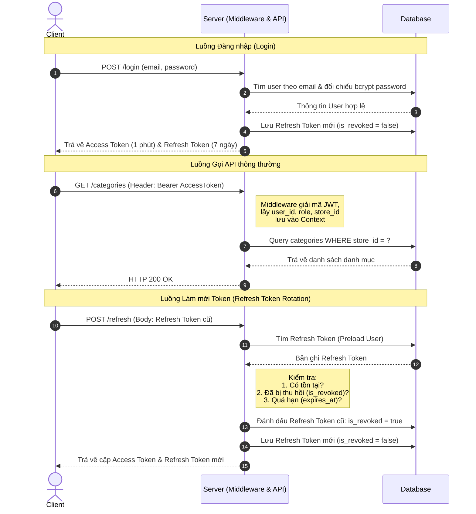

# Hướng dẫn trả lời phỏng vấn: Thiết kế Luồng Auth & Phân quyền trong Dự án

Tài liệu này hệ thống hóa tư duy thiết kế, luồng xử lý và cơ chế bảo mật của dự án **KazQRServe-BE** giúp bạn tự tin trả lời các câu hỏi phỏng vấn của nhà tuyển dụng.

---

## 1. Cơ chế Xác thực (Authentication) - JWT kết hợp Refresh Token Rotation

Dự án sử dụng cơ chế **Token-Based Authentication** với sự kết hợp của **Access Token (JWT)** và **Refresh Token (Database-backed)**.

### Access Token (Stateless JWT)
- **Bản chất:** Là JSON Web Token tự đóng gói thông tin (self-contained).
- **Thông tin chứa bên trong (Claims):** `user_id`, `role`, `store_id` (mã cửa hàng).
- **Thời hạn:** Ngắn (thực tế 15 - 30 phút, trong môi trường test cấu hình 1 phút).
- **Ưu điểm:** Giúp hệ thống hoạt động **Stateless**. Các API protected chỉ cần giải mã token, xác minh chữ ký bằng khóa bí mật (`jwtSecret`) để lấy thông tin định danh mà **không cần truy vấn Cơ sở dữ liệu (Database)** ở mỗi request, giúp tối ưu hiệu năng.

### Refresh Token (Stateful & Soft Revocation)
- **Bản chất:** Là một chuỗi ngẫu nhiên dài 64 ký tự (sinh từ 32 bytes an toàn bằng `crypto/rand` và chuyển sang dạng hex).
- **Lưu trữ:** Lưu trong Database để quản lý trạng thái (Stateful).
- **Thời hạn:** Dài (ví dụ: 7 ngày).
- **Trường dữ liệu quan trọng:** `expires_at` (thời gian hết hạn) và `is_revoked` (trạng thái đã bị thu hồi).
- **Cơ chế thu hồi (Soft Revocation):** Khi người dùng Đăng xuất (Logout) hoặc khi token hết hạn/làm mới, hệ thống chuyển `is_revoked = true` thay vì xóa vật lý khỏi DB. Điều này giúp lưu lại vết (Audit log) để phân tích hành vi bất thường nếu có tấn công xảy ra.

---

## 2. Luồng xử lý chi tiết (Flows)



### Điểm nhấn ghi điểm khi phỏng vấn về "Refresh Token Rotation":
> *"Trong dự án, em áp dụng cơ chế **Refresh Token Rotation (Xoay vòng)**. Khi Client yêu cầu cấp Access Token mới thông qua `/refresh`, hệ thống sẽ lập tức vô hiệu hóa (`is_revoked = true`) Refresh Token cũ đó và cấp một cặp token mới tinh. Việc này giúp giảm thiểu tối đa rủi ro nếu Refresh Token bị lộ. Nếu kẻ tấn công sở hữu token cũ và cố tình gọi refresh, hệ thống sẽ phát hiện ra token đó đã bị thu hồi và có thể đưa ra cảnh báo bảo mật, buộc tất cả thiết bị đăng nhập lại."*

---

## 3. Phân quyền & Cô lập dữ liệu (Authorization & Multi-tenancy)

Đây là điểm cực kỳ quan trọng đối với các dự án dạng SaaS (Software as a Service) quản lý nhiều cửa hàng.

### Phân quyền theo vai trò (Role-Based Access Control - RBAC)
Hệ thống sử dụng middleware `RequireRoles` để chặn trực tiếp các request không đúng thẩm quyền ở tầng Router:
- **Admin:** Có toàn quyền quản trị Store. Được phép thực hiện các thao tác ghi dữ liệu (tạo mới, sửa đổi, xóa bỏ) đối với Danh mục (`Category`) và Sản phẩm (`Product`).
- **Staff (Nhân viên):** Chỉ được cấp quyền đọc (Read-only). Nhân viên phục vụ hoặc thu ngân chỉ có quyền xem thực đơn (`GET /categories`, `GET /products`) để hỗ trợ khách order, hệ thống sẽ chặn mã lỗi **HTTP 403 Forbidden** nếu Staff cố tình gửi request POST/PUT/DELETE.

### Cô lập dữ liệu giữa các Store (Store-scoped / Multi-tenant isolation)
Mỗi User khi đăng nhập sẽ được gắn chặt với một `store_id` (trích xuất từ JWT qua middleware).
- **Ràng buộc khi xem dữ liệu:** Mọi câu lệnh truy vấn dữ liệu từ DB (Ví dụ: lấy danh mục món ăn) luôn đi kèm điều kiện lọc:
  ```sql
  SELECT * FROM categories WHERE store_id = ?
  ```
- **Ràng buộc khi tạo dữ liệu (Ví dụ: Thêm sản phẩm):** Khi Admin của một Store thêm sản phẩm mới vào danh mục món ăn, hệ thống bắt buộc phải thực hiện truy vấn kiểm tra chéo:
  ```go
  category, err := s.categoryRepo.FindByIDAndStoreID(categoryID, storeID)
  ```
  Nếu danh mục `categoryID` truyền lên thuộc về một Store khác, hệ thống sẽ lập tức từ chối và trả về lỗi **HTTP 400 Bad Request**. Điều này ngăn chặn triệt để lỗ hổng bảo mật **IDOR (Insecure Direct Object Reference)**, đảm bảo dữ liệu giữa các cửa hàng luôn độc lập và an toàn tuyệt đối.
