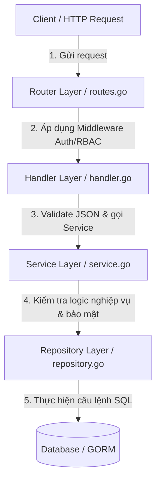

# Hướng dẫn Tư duy Thiết kế: Module Category & Product (Menu Module)

Tài liệu này phân tích chi tiết tư duy kiến trúc, các quyết định thiết kế phần mềm, luồng xử lý dữ liệu và cách giải quyết các bài toán bảo mật thực tế khi phát triển hai tính năng cốt lõi: **Quản lý Danh mục (Category)** và **Quản lý Sản phẩm (Product)**.

---

## 1. Kiến trúc phân tầng (Layered Architecture)
Dự án được xây dựng theo mô hình **Controller-Service-Repository (phân lớp có hướng)** nhằm tách biệt các mối quan tâm (Separation of Concerns), giúp code dễ bảo trì, dễ mở rộng và hỗ trợ viết kiểm thử (Unit Test) hiệu quả.



### Vai trò chi tiết của từng tầng:
1. **Model Layer (`model.go`)**:
   * Định nghĩa cấu trúc thực thể trong database sử dụng GORM.
   * Khai báo mối quan hệ khóa ngoại (ví dụ: `Product` liên kết với `Category` qua `CategoryID`, có cấu hình CASCADE khi xóa danh mục).
2. **Repository Layer (`repository.go`)**:
   * Chứa các câu lệnh truy vấn cơ sở dữ liệu thuần túy bằng GORM (CRUD).
   * **Nguyên tắc thiết kế:** Không chứa logic nghiệp vụ (business logic) hay kiểm tra quyền hạn. Repository chỉ nhận tham số và thực hiện câu lệnh DB.
3. **Service Layer (`service.go`)**:
   * Trái tim của module, nơi thực thi toàn bộ logic nghiệp vụ, kiểm tra ràng buộc dữ liệu và xử lý bảo mật chéo giữa các cửa hàng.
4. **Handler Layer (Controller - `handler.go`)**:
   * Điểm tiếp nhận request từ Web Server (Gin).
   * Thực hiện parse dữ liệu (URI params, Query params, JSON body) và kiểm tra định dạng đầu vào (Validation).
   * Định dạng dữ liệu trả về cho client (HTTP Status Code: `200 OK`, `201 Created`, `400 Bad Request`, `403 Forbidden`, `404 Not Found`).
5. **Routes Layer (`routes.go`)**:
   * Nơi đăng ký đường dẫn URL (Endpoints) và cấu hình chuỗi các middleware bảo vệ (Xác thực JWT, Phân quyền RBAC).

---

## 2. Tư duy thiết kế bảo mật cho hệ thống Multi-tenant (Store-scoped)

KazQR phục vụ nhiều cửa hàng khác nhau dưới dạng phần mềm dịch vụ (SaaS). Việc đảm bảo **cửa hàng này không đọc/sửa được dữ liệu của cửa hàng khác** (chống lỗi bảo mật IDOR - Insecure Direct Object Reference) được ưu tiên hàng đầu.

### A. Trích xuất thông tin Store từ Token (Stateless Verification)
* Khi người dùng đăng nhập thành công, ID cửa hàng của họ (`store_id`) được đóng gói trực tiếp vào **Access Token JWT**.
* Khi Client gọi bất kỳ API protected nào, `AuthMiddleware` sẽ giải mã chữ ký JWT, lấy ra `store_id` và lưu vào Gin Context (`c.Set("store_id", value)`).
* API Handler lấy trực tiếp `store_id` này từ Context để sử dụng. **Tuyệt đối không để Client tự truyền `store_id` lên qua Body hay Query param** vì Client có thể sửa đổi để hack dữ liệu của cửa hàng khác.

### B. Kiểm tra chéo (Cross-validation) khi thao tác dữ liệu
Khi Admin của Cửa hàng A tạo sản phẩm mới, họ truyền lên `category_id = 5`. Làm sao biết Danh mục số 5 này thuộc về cửa hàng A hay cửa hàng B?
* **Giải pháp trong Service Layer:**
  ```go
  category, err := s.categoryRepo.FindByIDAndStoreID(categoryID, storeID)
  ```
  Truy vấn DB tìm kiếm danh mục có ID bằng `5` **VÀ** phải thuộc sở hữu của `storeID` của Admin đó. Nếu không tìm thấy (trả về lỗi), lập tức chặn đứng hành động tạo sản phẩm và báo lỗi `"danh mục không tồn tại hoặc không thuộc cửa hàng của bạn"`.

---

## 3. Cơ chế liên kết và chuẩn hóa dữ liệu (Database Normalization & Joins)

Trong thiết kế cơ sở dữ liệu:
* Bảng `categories` có liên kết `store_id` trỏ đến cửa hàng sở hữu.
* Bảng `products` liên kết đến danh mục thông qua `category_id`.
* Để tối ưu hóa dữ liệu và tránh dư thừa dữ liệu (Database Normalization), **bảng `products` không chứa cột `store_id`**.

### Cách truy vấn sản phẩm theo Store:
Để lấy toàn bộ sản phẩm của cửa hàng có `store_id = 1`, chúng ta phải thực hiện phép nối (**JOIN**) giữa hai bảng:
```sql
SELECT products.* FROM products
JOIN categories ON categories.id = products.category_id
WHERE categories.store_id = 1;
```
Trong GORM, điều này được triển khai tối ưu như sau:
```go
err := r.db.
    Joins("JOIN categories ON categories.id = products.category_id").
    Where("categories.store_id = ?", storeID).
    Preload("Category").
    Find(&products).
    Error
```
* `Joins(...)` giúp cơ sở dữ liệu thực hiện lọc dữ liệu chính xác ở tầng DB.
* `Preload("Category")` yêu cầu GORM nạp kèm dữ liệu của danh mục món ăn tương ứng vào struct trả về cho Client.

---

## 4. Kỹ thuật Validation thông minh với Gin Binding

Khi thiết kế các struct Validate Request (ví dụ: `CreateProductRequest`):
```go
type CreateProductRequest struct {
    Name        string  `json:"name" binding:"required"`
    Price       float64 `json:"price" binding:"required,gte=0"`
    IsAvailable *bool   `json:"is_available" binding:"required"`
    CategoryID  uint    `json:"category_id" binding:"required"`
}
```

### Tại sao sử dụng con trỏ `*bool` cho trường `IsAvailable`?
* Trong ngôn ngữ Go, kiểu dữ liệu `bool` có giá trị mặc định (Zero Value) là `false`.
* Khi client gửi JSON yêu cầu tắt món ăn: `"is_available": false`:
  * Nếu khai báo kiểu dữ liệu là `bool` thuần: Thư viện `validator` của Gin khi quét qua tag `binding:"required"` sẽ kiểm tra xem giá trị có trống (zero-value) hay không. Do `false` trùng với zero-value của bool, validator sẽ hiểu lầm là client **không truyền trường này lên** và trả về lỗi **HTTP 400 Bad Request**.
  * Nếu khai báo là `*bool` (con trỏ): Khi client không truyền, giá trị sẽ là `nil`. Khi client truyền `false`, giá trị sẽ là con trỏ trỏ tới giá trị `false` (khác `nil`). Validator lúc này sẽ nhận diện chính xác và cho phép đi qua bình thường.
