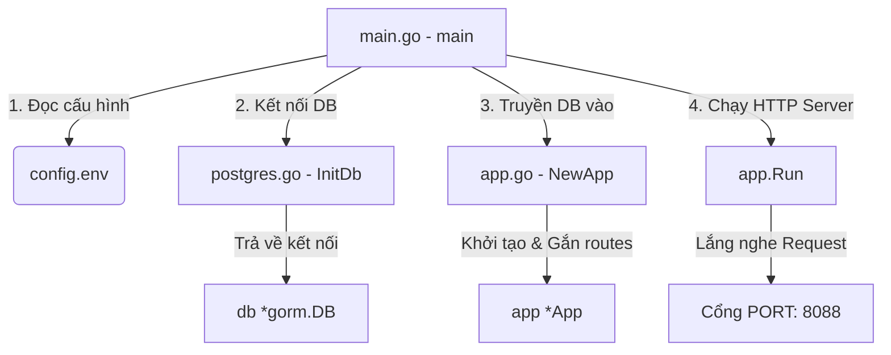

# Giải thích Chi tiết Kiến trúc và Các Khái niệm Kỹ thuật trong Dự án

Tài liệu này giải thích chi tiết về luồng hoạt động, vai trò của từng file bạn vừa viết, cách chúng liên kết với nhau và các kỹ thuật Go nâng cao (như con trỏ, Dependency Injection) được sử dụng.

---

## 1. Tư duy Tổng quan & Sơ đồ Luồng đi của Code

Hãy tưởng tượng bạn đang xây dựng một tòa nhà (ứng dụng).
* **Bản thiết kế & Vật liệu (`config.env`):** Nơi chứa thông số cấu hình (Port nào, DB ở đâu, mật khẩu là gì).
* **Người thợ khởi động (`cmd/api/main.go`):** Đọc bản thiết kế, bật máy phát điện (kết nối DB), lắp đặt khung nhà (khởi tạo App) rồi bấm nút vận hành.
* **Hệ thống cấp điện/nước (`internal/shared/database/postgres.go`):** Nơi tạo ra một cổng kết nối duy nhất đến database để cấp nước/điện cho toàn bộ tòa nhà.
* **Cơ cấu quản trị tòa nhà (`internal/app/app.go`):** Thiết lập sơ đồ đường đi (Routes) và quản trị các phòng ban (Handlers).

### Sơ đồ luồng chạy khi bạn gõ `go run cmd/api/main.go`:



---

## 2. Giải thích chi tiết từng File & Thành phần

### 2.1 File `config.env`
* **Nhiệm vụ:** Lưu trữ các hằng số cấu hình của hệ thống dưới dạng `KEY=VALUE`.
* **Tại sao cần tách riêng:** Để khi thay đổi cấu hình (ví dụ: đổi port từ `8080` sang `8088` hoặc đổi mật khẩu DB khi deploy lên hosting), bạn **không cần phải sửa và build lại mã nguồn Go**. Bạn chỉ cần sửa file `.env` này.

### 2.2 File `cmd/api/main.go` (Điểm đầu vào - Entrypoint)
* **Nhiệm vụ:** Là file duy nhất chứa hàm `main()`. Đây là nơi hệ điều hành nhảy vào chạy đầu tiên.
* **Hoạt động:** Nó đóng vai trò kết nối (như chất keo). Nó gọi hàm nạp cấu hình `.env`, gọi hàm mở kết nối database, gọi hàm tạo ứng dụng, và cuối cùng bắt đầu lắng nghe các cổng mạng (HTTP port).

### 2.3 File `internal/shared/database/postgres.go`
* **Nhiệm vụ:** Tạo ra một **Connection Pool** (vùng kết nối) tới PostgreSQL thông qua GORM.
* **Tại sao đặt trong `shared`:** Vì database là tài nguyên dùng chung. Sau này, module QR, module User, module Auth... đều sẽ cần dùng đến DB này để đọc/ghi dữ liệu.

### 2.4 File `internal/app/app.go`
* **Nhiệm vụ:** Cấu hình lõi của ứng dụng Web. Nó giữ đối tượng `*gin.Engine` (Engine của Gin framework để xử lý request) và đăng ký các đường dẫn URL (như `/ping`, `/api/v1/qrs`).

---

## 3. Giải thích các Kỹ thuật và Khái niệm Go đã sử dụng

### 3.1 Tại sao lại sử dụng Con trỏ (`*`) ở khắp nơi?
Trong Go, khi bạn truyền một biến vào một hàm (hoặc gán cho một biến khác), Go sẽ **sao chép (copy)** toàn bộ giá trị của biến đó sang vùng nhớ mới.

Nếu chúng ta truyền struct `gorm.DB` hoặc struct `App` theo kiểu thông thường (value type), Go sẽ nhân bản đối tượng đó. Điều này dẫn đến:
1. **Lãng phí RAM:** Nhân bản các struct nặng.
2. **Lỗi kết nối:** GORM DB quản lý một "hồ kết nối" (Connection Pool). Nếu bị nhân bản, nó sẽ tạo ra hàng chục kết nối mới tới PostgreSQL, dễ làm crash database.
3. **Không đồng bộ dữ liệu:** Nếu bạn thay đổi dữ liệu của bản sao, bản gốc sẽ không đổi.

👉 **Giải pháp:** Sử dụng **Con trỏ (Pointer - `*`)**
* Khi khai báo `db *gorm.DB`, chúng ta chỉ truyền đi **địa chỉ ô nhớ** của Database (dung lượng cực nhẹ, chỉ 8 bytes trên hệ điều hành 64-bit).
* Tất cả các file, các module khi dùng `db` đều đang trỏ chung về một chỗ duy nhất trong RAM.

---

### 3.2 Kỹ thuật Dependency Injection (Tiêm phụ thuộc)
Hãy nhìn vào cách bạn khởi tạo App:
```go
// Tại main.go
application := app.NewApp(db)
```
Thay vì trong `app.go` ta tự ý kết nối DB hoặc gọi một biến Global vô tội vạ, ta yêu cầu: *"Ai muốn tạo App thì phải truyền đối tượng kết nối `db` vào cho tôi."*

**Lợi ích:**
* **Dễ viết Unit Test (Mocking):** Sau này khi viết test, bạn không cần cài PostgreSQL thật. Bạn chỉ cần tạo một Database giả lập (Mock DB) rồi truyền vào `NewApp(mockDb)`.
* **Tránh phụ thuộc cứng (Decoupling):** Code của bạn linh hoạt hơn, dễ bảo trì hơn.

---

### 3.3 Phương thức nhận (Receiver Function)
Trong `app.go`, bạn viết:
```go
func (a *App) Run(addr string) error {
	return a.router.Run(addr)
}
```
Cú pháp `(a *App)` đứng trước tên hàm được gọi là **Receiver**. Nó biến hàm `Run` thành một phương thức (Method) của đối tượng `App` (tương tự như Class Method trong Java hay C#).
* `a` đóng vai trò giống như từ khóa `this` hoặc `self` ở các ngôn ngữ khác, đại diện cho thực thể App hiện tại.
* Vì dùng con trỏ `*App`, bạn có thể truy cập và thay đổi các thuộc tính bên trong nó (như `a.router` hay `a.db`).

---

### 3.4 Cơ chế xử lý lỗi `if err != nil`
Trong Go không có cơ chế `try-catch`. Mọi hàm có khả năng thất bại đều sẽ trả về một đối tượng `error`.
* Khi gọi `godotenv.Load()` hoặc `database.InitDb()`, ta bắt buộc phải check xem `err` có khác `nil` hay không.
* Nếu `err != nil` (có lỗi xảy ra), ta dùng `log.Fatalf` hoặc `log.Fatalln` để dừng chương trình ngay lập tức vì không có cấu hình hoặc DB thì Web Server không thể chạy được.
