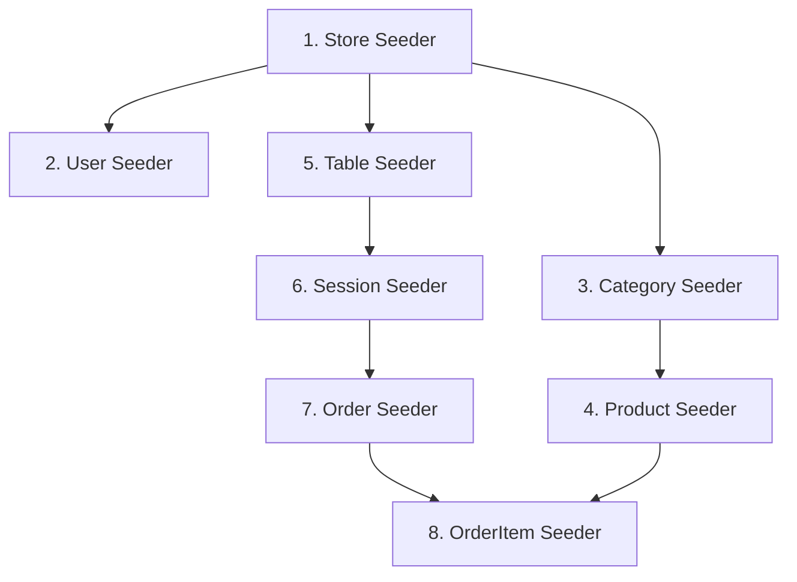

# Hướng Dẫn Kỹ Thuật Viết Seeder Trong Go (Sử Dụng GORM)

Tài liệu này hướng dẫn chi tiết về tư duy thiết kế, thứ tự chạy và các kỹ thuật lập trình Go được áp dụng để xây dựng hệ thống seeder dữ liệu mẫu cho dự án KazQRServe.

---

## 1. Tư Duy Thiết Kế Hệ Thống Seeder

Hệ thống seeder dữ liệu mẫu được xây dựng dựa trên 3 nguyên tắc cốt lõi:
1. **Tính tuần tự (Order of Execution):** Đảm bảo dữ liệu cha (Parent) được tạo trước dữ liệu con (Child).
2. **Tính bất biến và lặp lại (Idempotency):** Có thể chạy seeder nhiều lần mà không làm nhân bản dữ liệu hoặc gây lỗi trùng lặp khóa (`Duplicate Key Error`).
3. **Tham chiếu động (Dynamic ID Resolution):** Không gán cứng ID của các bản ghi liên kết, thay vào đó thực hiện truy vấn thời gian thực (real-time query) để lấy ID chính xác từ cơ sở dữ liệu.

---

## 2. Thứ Tự Chạy Seeder (Data Dependencies)

Do cơ sở dữ liệu PostgreSQL sử dụng các ràng buộc khóa ngoại (Foreign Key Constraints) chặt chẽ, các seeder bắt buộc phải chạy theo một thứ tự tuyến tính cụ thể:



### Chi tiết các bước:
1. **Store Seeder (`SeedStores`):** Tạo cửa hàng trước vì mọi tài nguyên (User, Category, Table) đều thuộc về một cửa hàng cụ thể.
2. **User Seeder (`SeedUsers`):** Tạo tài khoản quản trị và nhân viên liên kết với cửa hàng thông qua `store_id`.
3. **Category Seeder (`SeedCategories`):** Tạo danh mục thực đơn liên kết với cửa hàng.
4. **Product Seeder (`SeedProducts`):** Tạo sản phẩm/món ăn liên kết với danh mục qua `category_id`.
5. **Table Seeder (`SeedTables`):** Tạo bàn ăn liên kết với cửa hàng và tạo mã định danh UUID tĩnh.
6. **Session Seeder (`SeedSessions`):** Tạo phiên ăn uống của bàn liên kết với `table_id`.
7. **Order Seeder (`SeedOrders`):** Tạo đơn hàng của khách liên kết với phiên ăn uống qua `session_id`.
8. **OrderItem Seeder (`SeedOrderItems`):** Tạo các chi tiết món ăn trong đơn hàng liên kết với `order_id` và `product_id`.

---

## 3. Các Kỹ Thuật Lập Trình Áp Dụng

### Kỹ thuật 1: Kiểm tra tính tồn tại (Idempotency)
Để tránh lỗi trùng lặp khóa ngoại hoặc dữ liệu bị chèn trùng nhau khi chạy lại lệnh seed nhiều lần, chúng ta thực hiện tìm kiếm bản ghi trước khi tạo:

```go
for _, item := range list {
    var existing model.Struct
    // Tìm theo trường định danh duy nhất (ví dụ: Email, UUID, hoặc kết hợp Name + StoreID)
    err := db.Where("unique_field = ?", item.UniqueField).First(&existing).Error
    
    if err == nil {
        continue // Bản ghi đã tồn tại, bỏ qua không tạo mới
    }
    
    if err != gorm.ErrRecordNotFound {
        return err // Gặp lỗi kết nối DB hoặc lỗi hệ thống khác
    }
    
    // Chỉ tạo mới khi không tìm thấy bản ghi cũ
    if err := db.Create(&item).Error; err != nil {
        return err
    }
}
```

### Kỹ thuật 2: Truy vấn ID động (Dynamic ID Resolution)
Không được gán cứng các ID như `StoreID: 1` hoặc `CategoryID: 2` vì trong cơ sở dữ liệu thực tế, cơ chế tự tăng (Auto-increment) có thể sinh ra các ID khác nhau. Hãy dùng câu lệnh truy vấn để tìm bản ghi cha:

```go
var parentStore store.Store
if err := db.Where("email = ?", "kazcoffee@example.com").First(&parentStore).Error; err != nil {
    return err // Trả về lỗi nếu bản ghi cha chưa được tạo
}

// Sử dụng ID tìm được để gán cho bản ghi con
childUser := auth.User{
    Email:   "staff@example.com",
    StoreID: parentStore.ID, 
}
```

### Kỹ thuật 3: Mã hóa mật khẩu mẫu (Password Hashing)
Đối với các tài khoản người dùng mẫu, không lưu mật khẩu ở dạng văn bản thuần (Plaintext) vào database. Sử dụng thư viện chuẩn của Go để băm mật khẩu bằng thuật toán **bcrypt**:

```go
import "golang.org/x/crypto/bcrypt"

// Mã hóa trước vòng lặp để tránh tốn CPU/RAM khi mã hóa nhiều lần
hashedPassword, err := bcrypt.GenerateFromPassword([]byte("mật_khẩu_gốc"), bcrypt.DefaultCost)
if err != nil {
    return err
}
passStr := string(hashedPassword)
```

---

## 4. Cách Tích Hợp Và Kích Hoạt Seeder

Tất cả các seeder con được quản lý tập trung tại [seeder.go](file:///home/uwal/Desktop/KazQRServe-BE/internal/shared/database/seeder/seeder.go) qua hàm `Run`:

```go
func Run(db *gorm.DB) error {
	if err := SeedStores(db); err != nil { return err }
	if err := SeedUsers(db); err != nil { return err }
	if err := SeedCategories(db); err != nil { return err }
	if err := SeedProducts(db); err != nil { return err }
	if err := SeedTables(db); err != nil { return err }
	if err := SeedSessions(db); err != nil { return err }
	if err := SeedOrders(db); err != nil { return err }
	if err := SeedOrderItems(db); err != nil { return err }
	return nil
}
```

Để kích hoạt hệ thống seeder, bạn chỉ cần gọi `seeder.Run(db)` ngay sau khi thực hiện migration cơ sở dữ liệu trong hàm `main()` của ứng dụng:

```go
// cmd/api/main.go
import "github.com/nguyenquangthuong23082004/KazQRServe-BE/internal/shared/database/seeder"

// ... trong func main() ...
if err := database.AutoMigrate(db); err != nil {
    log.Fatalln("Error migrating database: ", err)
}

// Chạy seeder tự động (khuyên dùng cho môi trường dev)
if err := seeder.Run(db); err != nil {
    log.Printf("Warning: Failed to run seeders: %v", err)
}
```
